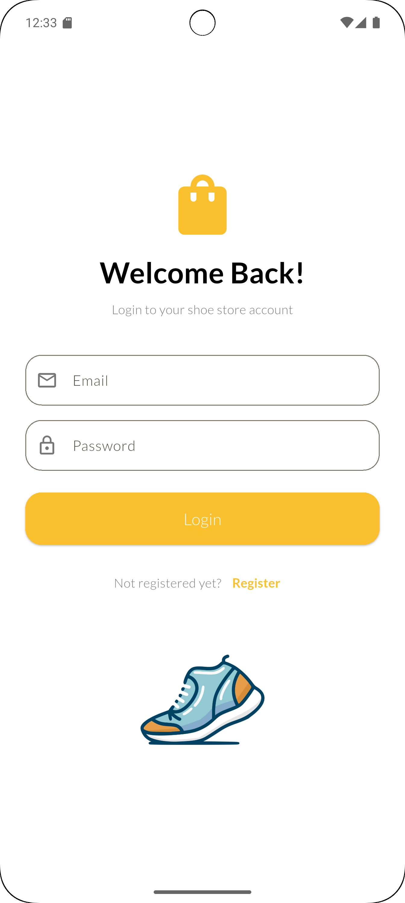
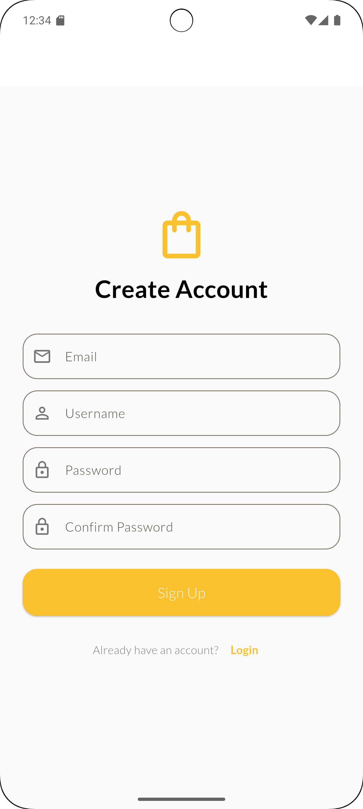
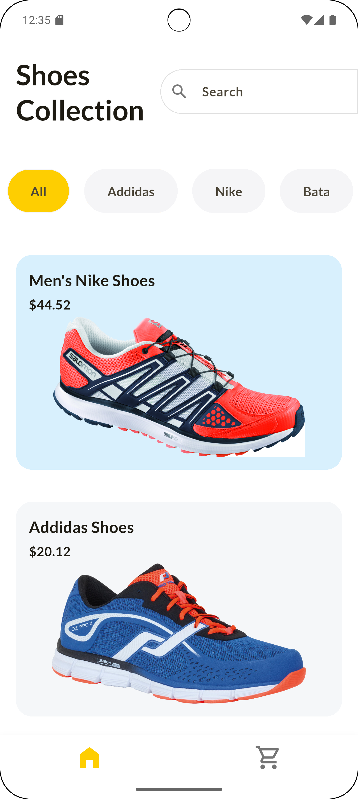
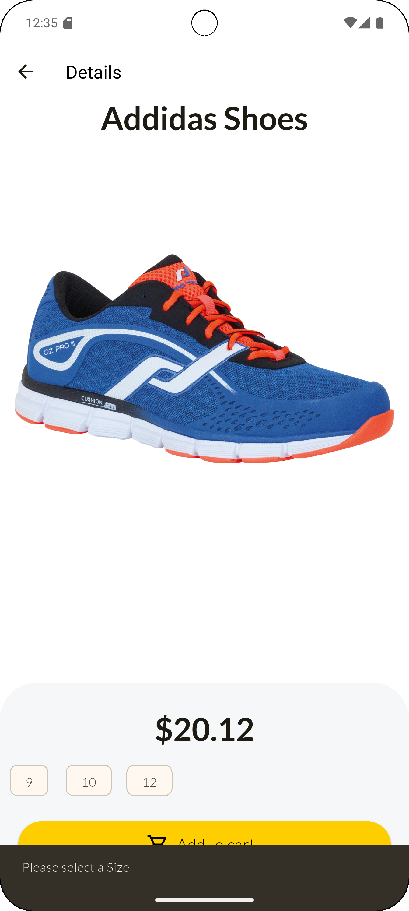
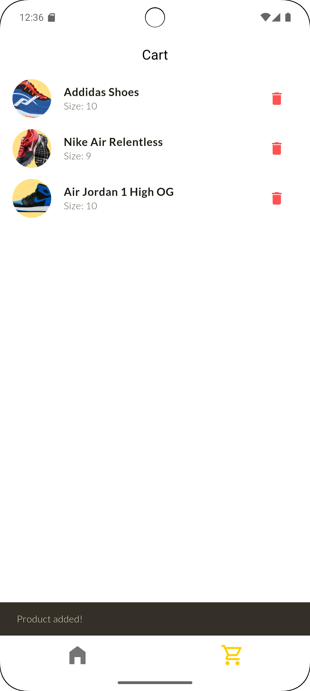
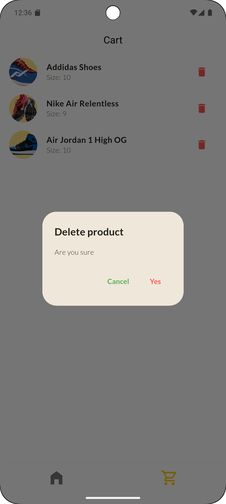

# 👟 Flutter Shoe Store App

A stylish and modern e-commerce application for a shoe store, built with Flutter. This app features a clean user interface, smooth navigation, and essential e-commerce functionalities, all managed efficiently using the **Provider** state management solution.


---

## ✨ Features

-   **🚪 User Authentication:** Secure and simple login and registration pages for a personalized user experience.
-   **🛍️ Product Catalog:** Browse a dynamic list of available shoes on the home screen.
-   **🔍 Search & Filter:** Easily find specific shoes with a prominent search bar and filter products by brand (e.g., Nike, Adidas, Bata).
-   **👟 Product Details:** View detailed information for each shoe, including price, and select from available sizes before adding to the cart.
-   **🛒 Shopping Cart:** A fully functional cart where users can:
    -   Add items with a selected size.
    -   View all items added to the cart in a clean list.
    -   Remove items with a confirmation dialog to prevent accidental deletion.
-   **💬 User Feedback:** Informative toast messages for actions like adding a product or needing to select a size.
-   **🎨 Clean & Modern UI:** A visually appealing and user-friendly interface designed for a seamless shopping experience.

---

## 📸 Screenshots

| Login & Register | Home & Product Details | Cart Management |
| :---: | :---: | :---: |
|   |   |   |

---

## 🛠️ Technology Stack

-   **Framework:** [Flutter](https://flutter.dev/)
-   **Programming Language:** [Dart](https://dart.dev/)
-   **State Management:** [Provider](https://pub.dev/packages/provider)

---

## 🚀 Getting Started

To get a local copy up and running, follow these simple steps.

### Prerequisites

Make sure you have the Flutter SDK installed on your machine.
-   [Flutter Installation Guide](https://flutter.dev/docs/get-started/install)

### Installation

1.  **Clone the repository:**
    ```sh
    git clone https://github.com/OnoPUNPUN/shopping_app.git
    ```
2.  **Navigate to the project directory:**
    ```sh
    cd shopping_app
    ```
3.  **Install dependencies:**
    ```sh
    flutter pub get
    ```
4.  **Run the app:**
    ```sh
    flutter run
    ```

---

<p align="center">
  Made with ❤️ and Flutter
</p>
